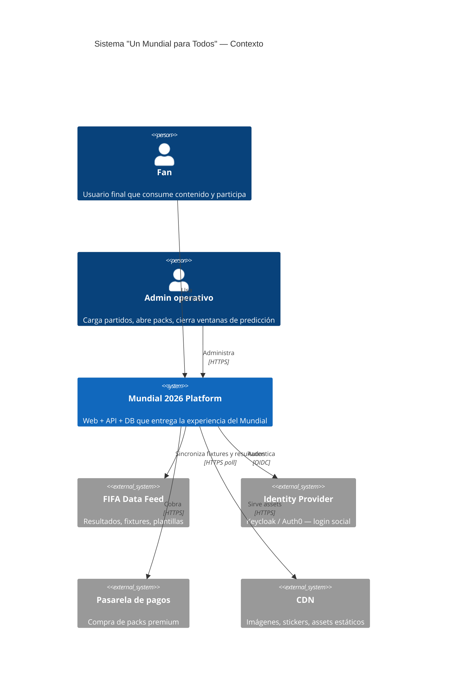
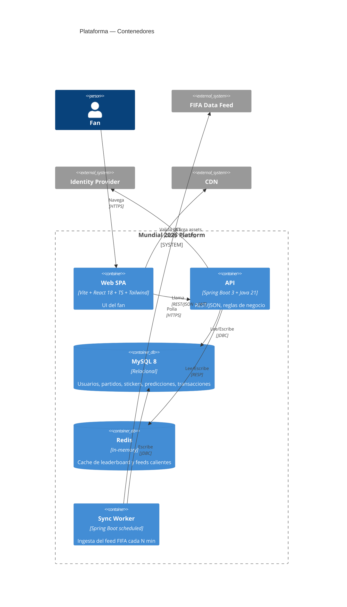
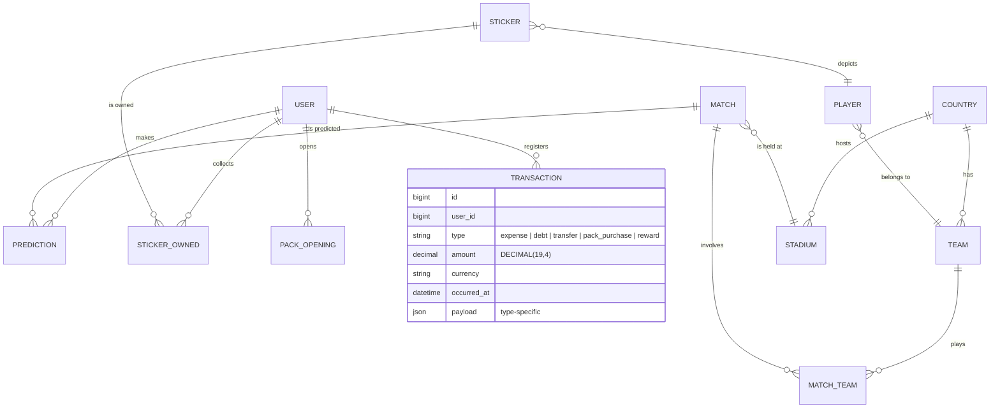
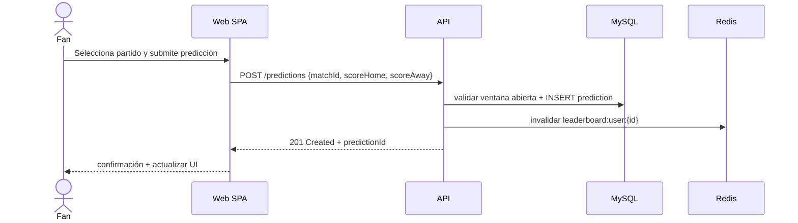
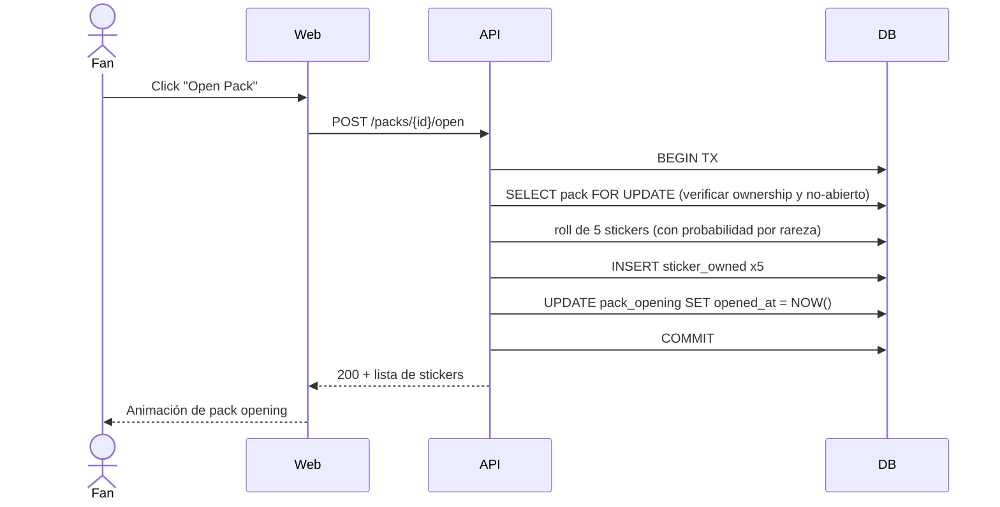

# Arquitectura — Mundial 2026 Hub

> Documento vivo. Última actualización: 2026-05-02.
> Diagramas oficiales (drawio) en [`diagrams/`](diagrams/).

## 1. Visión

**Mundial 2026 Hub** es una plataforma web (SPA) + API REST que entrega la experiencia digital del Mundial FIFA 2026. El producto cubre cuatro ejes según el documento del proyecto:

1. **Seguimiento de partidos y estadísticas** (datos de proveedor externo + caché).
2. **Agenda personalizada y planificación por ciudades/estadios**.
3. **Notificaciones multicanal y comunicación operativa** (FCM + email).
4. **Flujos de entradas y atención de solicitudes** (ticketing simulado con Stripe test / Wiremock).

El **MVP académico** se concentra en: registro/login, perfil, **pollas con ranking** (RF-09 a RF-12), **álbum digital con intercambios** (RF-13 a RF-15), y **trazabilidad/logs auditables** (RF-24).

El valor diferenciador es la **transparencia y trazabilidad**: el sistema registra eventos relevantes (cambios de calendario, notificaciones, predicciones, aperturas de packs, intercambios, decisiones antifraude) de forma auditable con `correlationId` por request.

## 2. Diagrama de contexto (C4 Nivel 1)

## 3. Diagrama de contenedores (C4 Nivel 2)

## 4. Vistas y rutas (frontend)

| Ruta            | Vista          | Descripción                                      | User Story |
| --------------- | -------------- | ------------------------------------------------ | ---------- |
| `/`             | Dashboard      | Hero del próximo partido, accesos rápidos        | US-5       |
| `/stadiums`     | Stadiums list  | Grid de estadios anfitriones                     | US-2       |
| `/stadiums/:id` | Stadium detail | Capacidad, mapa de calor, próximos partidos      | US-2       |
| `/album`        | Album digital  | Progreso, packs, gallery                         | US-3       |
| `/superpolla`   | Predicciones   | Leaderboard, mis predicciones, standings         | US-4       |
| `/horizon`      | Horizon 26     | Vista editorial (ver `design-source/horizon_26`) | —          |

## 5. Modelo de datos (alto nivel)

Detalles del modelado de transacciones (relacional con `JSON payload` para tipos heterogéneos): ver [ADR-0004](adrs/0004-database-relational-with-json.md).

## 6. Flujos críticos

### 6.1 Predicción de un partido

### 6.2 Apertura de pack del álbum

## 7. Cross-cutting concerns

| Tema               | Cómo lo resolvemos                                                          |
| ------------------ | --------------------------------------------------------------------------- |
| **Auth**           | OIDC (Keycloak o Auth0). API valida JWT. Roles: `FAN`, `ADMIN`.             |
| **i18n**           | `react-i18next`. Idiomas: `es-MX` (default), `en-US`, `fr-CA`.              |
| **Observabilidad** | OpenTelemetry → backend a Datadog (o equivalente). Logs estructurados JSON. |
| **Cache**          | Redis para leaderboard (TTL 60s) y fixtures (TTL 5min).                     |
| **Imágenes**       | CDN (Cloudflare/CloudFront). `srcset` + WebP.                               |
| **A11y**           | WCAG AA mínimo. Audit con axe en CI.                                        |
| **Perf budget**    | LCP < 2.5s en 4G mediano. Bundle inicial < 200kB gzip.                      |

## 8. Dónde está cada cosa en el código

| Necesito…                     | Está en…                                             |
| ----------------------------- | ---------------------------------------------------- |
| Una vista/ruta nueva          | `apps/web/src/routes/`                               |
| Un componente UI reutilizable | `apps/web/src/components/ui/`                        |
| Lógica de dominio frontend    | `apps/web/src/lib/` o `apps/web/src/hooks/`          |
| Tipos compartidos web↔api     | `packages/shared-types/src/`                         |
| Un endpoint nuevo             | `apps/api/src/main/java/.../controller/`             |
| Una migración de DB           | `apps/api/src/main/resources/db/migration/` (Flyway) |
| Un ADR                        | `docs/architecture/adrs/`                            |

## 9. Diagramas oficiales (drawio)

Estos son los entregables del curso. Cada uno tiene una versión Mermaid embebida arriba para navegación rápida.

| Diagrama                                         | Archivo                                                                      |
| ------------------------------------------------ | ---------------------------------------------------------------------------- |
| Contexto C4 nivel 1 (sistema + actores externos) | [`diagrams/DiagramaContexto.drawio`](diagrams/DiagramaContexto.drawio)       |
| Paquetes UML (capas + 26 RFs por módulo)         | [`diagrams/DiagramaDePaquetes.drawio`](diagrams/DiagramaDePaquetes.drawio)   |
| Modelo E-R                                       | [`diagrams/Modelo E-R.drawio`](diagrams/Modelo%20E-R.drawio)                 |
| Modelo E-R Extendido (alimenta el `schema.sql`)  | [`diagrams/ModeloE-R-Extendido.drawio`](diagrams/ModeloE-R-Extendido.drawio) |

## 10. Capas del sistema (visión de paquetes)

Resumen del DiagramaDePaquetes.drawio:

| Capa                                    | Componentes                                                                                                                                                                                                          |
| --------------------------------------- | -------------------------------------------------------------------------------------------------------------------------------------------------------------------------------------------------------------------- |
| **1. Presentación**                     | `Web_Aficionado` (Dashboard, Album, Pollas) · `Web_Admin_Operador` (CRM, Compliance)                                                                                                                                 |
| **2. Aplicación (casos de uso)**        | `Auth_Onboarding` (RF-01,02,03) · `Comunidades` (RF-04) · `Agenda_Partidos` (RF-05,07,08) · `Torneo_Pollas` (RF-09 a 12) · `Album` (RF-13 a 15) · `Ticketing` (RF-16,17,19,20) · `Soporte_Operaciones` (RF-23,25,26) |
| **3. Dominios (reglas de negocio)**     | `Usuarios` · `Deportes` · `Pollas` · `Album` · `Entradas`                                                                                                                                                            |
| **4. Infra de negocio (integraciones)** | `Notificaciones_Engine` (RF-21,22) · `Simulador_Pagos_Sandbox` (RF-18) · `Integracion_API_Deportiva` (RF-06,08)                                                                                                      |
| **5. Infra técnica**                    | `Seguridad_Auth` · `Persistencia_MySQL` · `Auditoria_Trazabilidad` (RF-24)                                                                                                                                           |
| **6. Utilidades base**                  | `Utilidades_Core` (Horarios, Hashes, Excepciones)                                                                                                                                                                    |

## 11. Referencias

- [ADRs](adrs/)
- [Diagramas drawio](diagrams/)
- [Design system](../design-system/DESIGN.md)
- [Spec funcional](../product/spec.md)
- PDF original del proyecto (subido por el equipo, no versionado en repo)
- Propuesta del equipo (`DocumentoProyecto_FinalRevision.docx`, no versionado)
